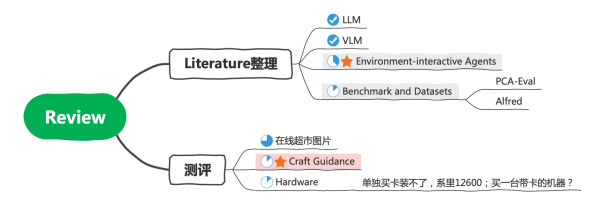

## 总览

## 进度
Review当前主要是整理LLM-based Environment-interactive Agents
### 1. Reasoning Literatures
* 进度：主要看了前3篇，ToDo：整理进Review

| Index | Name |
|-------|-----|
| 1     | Chain of thought prompting elicits reasoning in large language models. arXiv preprint arXiv:2201.11903, 2022. | 
| 2     | Least-to-most prompting enables complex reasoning in large language models, 2022. |
| 3     | Self-consistency improves chain of thought reasoning in language models, 2022a. |
| 4     | Text and patterns: For effective chain of thought, it takes two to tango, 2022.    |
| 5     | Selection-inference: Exploiting large language models for interpretable logical reasoning, 2022. |
| 6     | Star: Bootstrapping reasoning with reasoning, 2022. |
| 7     | Faithful reasoning using large language models, 2022. |
| 8     | Show your work: Scratchpads for intermediate computation with language models, 2021. |

### 2. Agents Literatures
* MineCraft Agents----ing中

| Index | Name |
|-------|--------|
| 1     | Minedojo: Building open-ended embodied agents with internet-scale knowledge. In Thirty-sixth Conference on Neural Information Processing Systems Datasets and Benchmarks Track, 2022. |
| 2     | Voyager: An open-ended embodied agent with large language models. arXiv preprint arXiv:2305.16291, 2023a. |
| 3     | Ghost in the minecraft: Generally capable agents for open-world environments via large language models with text-based knowledge and memory. arXiv preprint arXiv:2305.17144, 2023b. |

* 其他domestic agents等，ToDo

| Index | Name |
|-------|--------|
| 1     | Inner monologue: Embodied reasoning through planning with language models. In arXiv preprint arXiv:2207.05608, 2022b.| 

### 3.测评、Data、Benchmark Literatures
| Index | Name                          | Paper |
|-------|-------------------------------|--------|
| 1     | PCA-EVAL  [测评Benchmark可参考]    | Towards End-to-end Embodied Decision Making via Multi-modal Large Language Model: Explorations with GPT4-Vision And Beyond|
| 2     | ALFRED  [环境简单，色彩少；超市场景复杂度高很多] | ALFRED: A Benchmark for Interpreting Grounded Instructions for Everyday Tasks. In The IEEE Conference on Computer Vision and Pattern Recognition (CVPR), 2020.|

## ToDo