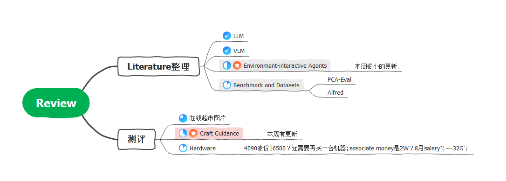
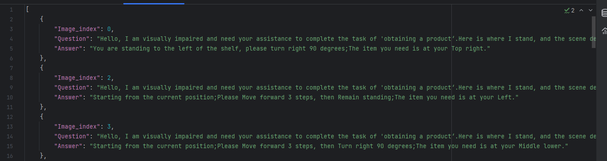
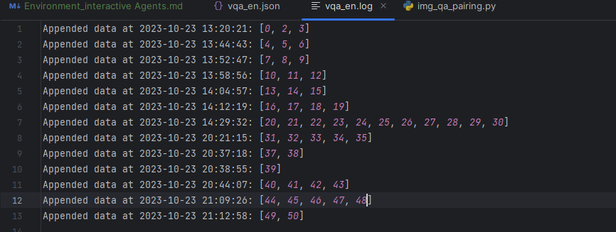

## 总览

## 进度
### 1. Benchmark
link: <https://github.com/YiyiyiZhao/benchmark>

1.1 标注test Q-A

1.2 补充图片----小红书----貌似不容易爬虫---优先度很低
1.3 Model----无法测试GPT4-V；其他模型可能主要VLM；Embodied需要查一下；硬件限制可能无法locally run；BLIVA space is closed now;
1.4 Metrics----待补充；参考的PCA-EVAL中为MCQ--accuracy，reasoning---similarity 0～1

| **Name**                                                                                                    |
|-------------------------------------------------------------------------------------------------------------|
| Voyager                                                                                                     |
| Ghost In The MineCraft                                                                                      |
| ReACT                                                                                                       |
| ProgPrompt                                                                                                  |
| Code as Policies                                                                                            |
| VoxPoser                                                                                                    |
| Socratic Models                                                                                             |
| SayCan                                                                                                      |
| LLM-Planner                                                                                                 |
| Inner Monologue                                                                                             |
|                                                                                                             |
| Grounded Decoding                                                                                           |
| Inner Monologue                                                                                             |
| Language Models as Zero-Shot Planners                                                                       |
| Pre-Trained Language Models for Interactive Decision-Making                                                 |
| Vision-and-Language Navigation: Interpreting visually-grounded navigation instructions in real environments |
| Visual Language Maps for Robot Navigation                                                                   |
| Iterative Vision-and-Language Navigation                                                                    |

## ToDo