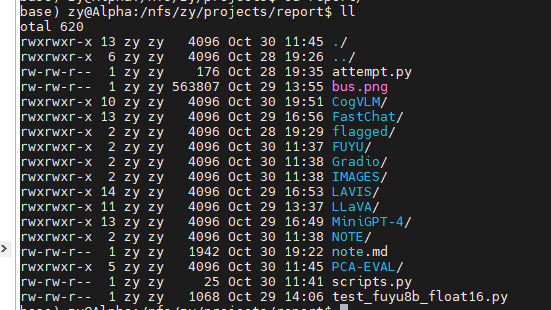
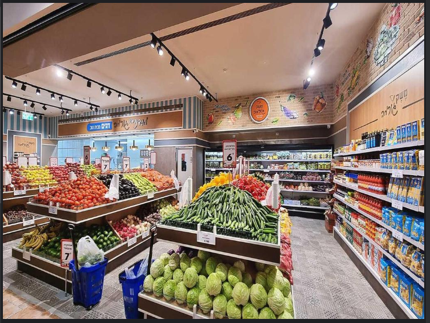
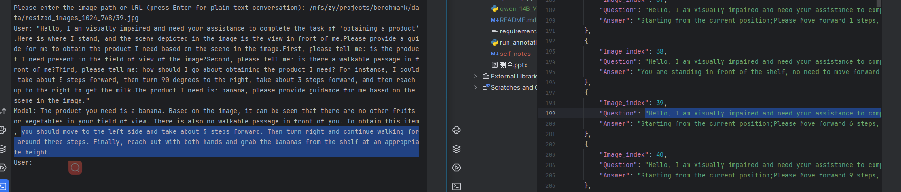
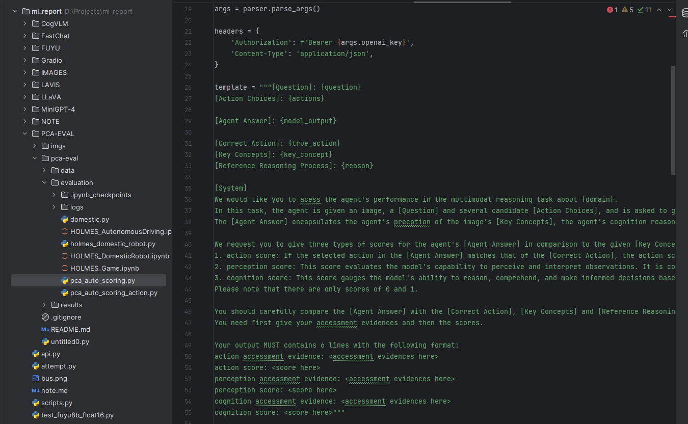

## 总览

## 进度
### 1. Model Test 目录
Server:10.21.4.51

### 2. Qwen Example
* image：  /nfs/zy/projects/benchmark/data/resized_images_1024_768/39.jpg

* ***Qwen-VL-Chat-Int4 模型输出***：The product you need is a banana. Based on the image, it can be seen that there are no other fruits 
or vegetables in your field of view. There is also no walkable passage in front of you. To obtain this item
, you should move to the left side and take about 5 steps forward. Then turn right and continue walking for
 around three steps. Finally, reach out with both hands and grab the bananas from the shelf at an appropria
te height.

#### ToDo：
进一步分析结果
可借鉴PCA-EVAL类似？

### 3. Paper Reading
Github Link: <https://github.com/YiyiyiZhao/paper_reading/tree/main>

| **Name**                                                                     |
|------------------------------------------------------------------------------|
| Multimodal Foundation Models: From Specialists to General-Purpose Assistants |
| COGVLM: VISUAL EXPERT FOR LARGE LANGUAGE MODELS                              | 
| A Survey on Large Language Model based Autonomous Agents                     |
| Cognitive Architectures for Language Agents|

## Todo:
1. Review 更新补充
2. Test的结果跑出来