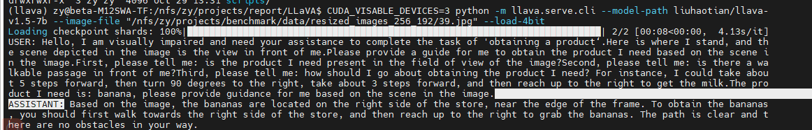
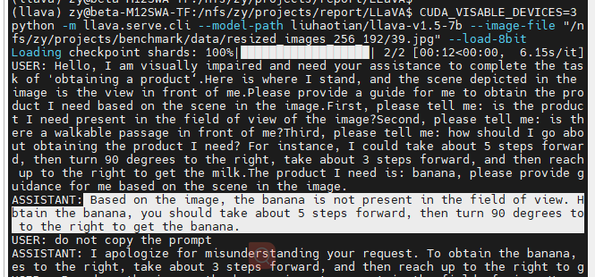
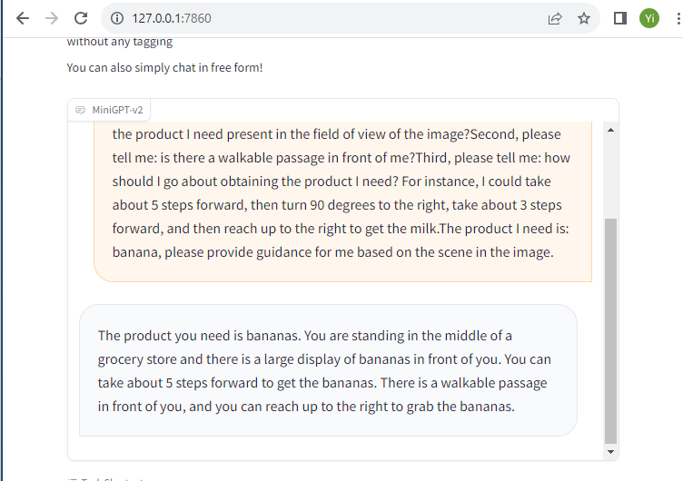
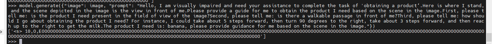
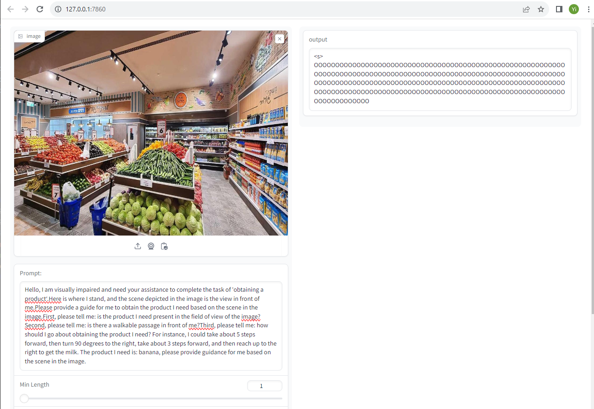

## 总览

## 进度
### 1. Model Test 目录
Server:10.21.4.51

### 2. Qwen Example
* image：  /nfs/zy/projects/benchmark/data/resized_images_1024_768/39.jpg

* ***User***：
Hello, I am visually impaired and need your assistance to complete the task of 'obtaining a product‘.Here is where I stand, and the scene depicted in the image is the view in front of me.Please provide a guide for me to obtain the product I need based on the scene in the image.First, please tell me: is the product I need present in the field of view of the image?Second, please tell me: is there a walkable passage in front of me?Third, please tell me: how should I go about obtaining the product I need? For instance, I could take about 5 steps forward, then turn 90 degrees to the right, take about 3 steps forward, and then reach up to the right to get the milk.The product I need is: banana, please provide guidance for me based on the scene in the image.

* 1. ***Qwen-VL-Chat-Int4 模型输出*** ：The product you need is a banana. Based on the image, it can be seen that there are no other fruits 
or vegetables in your field of view. There is also no walkable passage in front of you. To obtain this item
, you should move to the left side and take about 5 steps forward. Then turn right and continue walking for
 around three steps. Finally, reach out with both hands and grab the bananas from the shelf at an appropria
te height.

* 2. ***CogVLM-Chat-17B-Float16 模型输出 [双卡4090 Model Parallel]***：: The banana is located in the middle of the image, on a shelf. 
You can take about 5 steps forward and then turn to your right. 
Then, you should walk towards the left side of the shelf with the orange sign that says "6" above it. 
Finally, reach up with both hands and grab the yellow bananas.

* 3. ***Fuyu-8B-Float16 模型输出***：
 Yes, the product is a banana.
2. Yes, there is a walkable passage in front of the image.
3. Yes, there is a shopping cart in the scene.
4. Yes, there is a blue basket in the scene.
5. Yes, there is a shopping cart in the scene.
6. Yes, there is a shopping cart in the scene.
7. Yes, there is a shopping cart in the scene.
8. Yes, there is a shopping cart in the scene.
9. Yes, there is a shopping cart in the scene.
10. Yes, there is a shopping cart in the scene.
11. Yes, there is a shopping cart in the scene.
12. Yes, there is a shopping cart in the scene.
13. Yes, there is a shopping cart in the scene.
14. Yes, there is a shopping cart in the scene.
15. Yes, there is a shopping cart in the scene.
16. Yes, there is a shopping cart in the scene.
17. Yes, there is a shopping cart in the scene.
18. Yes, there is a shopping cart in the scene.
19. Yes, there is a shopping cart in the scene.
20. Yes, there is a shopping cart in the scene.

* 4. ***LLaVA-Vicuna-7B-v1.5-Int4 模型输出 [单卡4090， img 256*192 /4;/4]***: 
Based on the image, the bananas are located on the right side of the store, near the edge of the frame. 
To obtain the bananas, you should first walk towards the right side of the store, 
and then reach up to the right to grab the bananas. 
The path is clear and there are no obstacles in your way.

* 5. ***LLaVA-Vicuna-7B-v1.5-Int8 模型输出 [单卡4090， img 256*192 /4;/4]***: 
 Based on the image, the banana is not present in the field of view. 
However, there is a walkable passage in front of you. 
To obtain the banana, you should take about 5 steps forward, 
then turn 90 degrees to the right, take about 3 steps forward, 
and then reach up to the right to get the banana.

* 6. ***MiniGPT-V2-LLaMa2-Chat-7B-8bit模型输出[单卡4090]***

* 7. ***Blip模型输出***：

#### ToDo：
进一步分析结果
可借鉴PCA-EVAL类似？

### 3. Paper Reading
Github Link: <https://github.com/YiyiyiZhao/paper_reading/tree/main>

| **Name**                                                                     |
|------------------------------------------------------------------------------|
| Multimodal Foundation Models: From Specialists to General-Purpose Assistants |
| COGVLM: VISUAL EXPERT FOR LARGE LANGUAGE MODELS                              | 
| A Survey on Large Language Model based Autonomous Agents                     |
| Cognitive Architectures for Language Agents|

## Todo:
1. Review 更新补充
2. Test的结果跑出来
