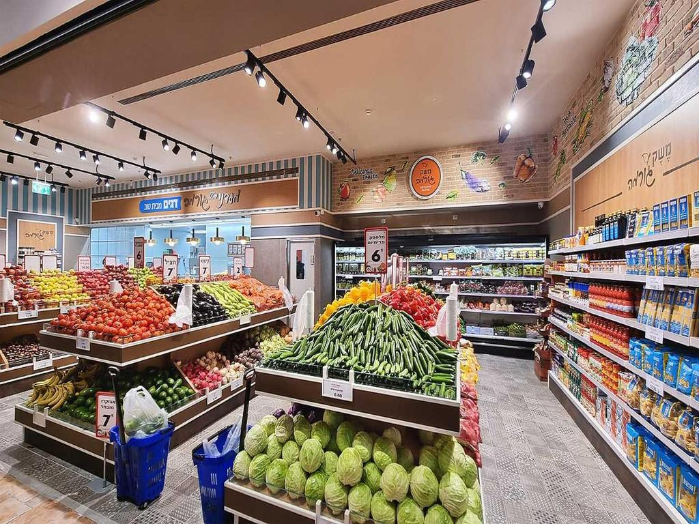

## 总览

## 进度
### 1.LLM微服务
Shell 1 界面

Shell2 界面

### 2. Benchmark Data 更新
| **Image** |                                                                                                                                                                                                                                                                                                                                                                                                                                                                                                                                                                                                                                                                                                                                                                                                                                                                                                                                                                                                                                                                                                                                                                                                                                                                                                                          |
|---------|---------------------------------------------------------------------------------------------------------------------------------------------------------------------------------------------------------------------------------------------------------------------------------------------------------------------------------------------------------------------------------------------------------------------------------------------------------------------------------------------------------------------------------------------------------------------------------------------------------------------------------------------------------------------------------------------------------------------------------------------------------------------------------------------------------------------------------------------------------------------------------------------------------------------------------------------------------------------------------------------------------------------------------------------------------------------------------------------------------------------------------------------------------------------------------------------------------------------------------------------------------------------------------------------------------------------------------------------------|
| **1-U** | "Hello, I am visually impaired and need your assistance; this is where I stand, and the scene depicted in the image is the view in front of me. Can you first inform me of the product area I am situated in? Is it the section for vegetables, fruits, beverages, snacks, or some other categories?"                                                                                                                                                                                                                                                                                                                                                                                                                                                                                                                                                                                                                                                                                                                                                                                                                                                                                                                                                                                                                                             |
| **1-A** | "Hello, I am glad to be of service to you! From the image, it appears that you are located in the fruits and vegetables section."                                                                                                                                                                                                                                                                                                                                                                                                                                                                                                                                                                                                                                                                                                                                                                                                                                                                                                                                                                                                                                                                                                                                                                                                                 |
| **2-U** | "Ah, I got it. In that case, I would like to purchase some fruits"                                                                                                                                                                                                                                                                                                                                                                                                                                                                                                                                                                                                                                                                                                                                                                                                                                                                                                                                                                                                                                                                                                                                                                                                                                                                                |
| **2-A** | "Excellent choice! The fruits and vegetables section offers a variety of options. Would you like assistance in choosing a specific type, or do you need a recommendation based on what's available? Perhaps I might suggest trying some lemon,apple, or banana?"                                                                                                                                                                                                                                                                                                                                                                                                                                                                                                                                                                                                                                                                                                                                                                                                                                                                                                                                                                                                                                                                                  |
| **3-U** | "Yes, thank you. The specific type of product I want is banana. Is there a walkable passage in front of me? Can you guide me to it based on the scene in the image? Could you please provide me with guidance following a 3-step prototype? The first step is chosen from the following options: start_cases={0: 'Starting from the current position;', 1: 'You are standing in front of the shelf, no need to move forward or backward;', 2: 'You are standing to the left of the shelf, please turn right 90 degrees;', 3: 'You are standing to the right of the shelf, please turn left 90 degrees;'}. The second step involves a sequence where each element combines two parts: forward movement and rotation. The options for rotation are: rotation=['Turn left 90 degrees', 'Turn left 45 degrees', 'Remain standing', 'Turn right 45 degrees', 'Turn right 90 degrees']. And for forward movement:forward_en =['Move forward 1 steps', 'Move forward 2 steps', 'Move forward 3 steps', 'Move forward 4 steps', 'Move forward 5 steps', 'Move forward 6 steps', 'Move forward 7 steps', 'Move forward 8 steps', 'Move forward 9 steps']. The third step is about grasping the product. Here are the options: grap_en = ['Top left', 'Middle upper', 'Top right', 'Left', 'Front', 'Right', 'Bottom left', 'Middle lower', 'Bottom right'] |
| **3-A** | "It's my pleasure to guide you! For the part of the guidance: Starting from the current position;Please Move forward 6 steps, then Turn right 45 degrees;Please Move forward 1 steps, then Remain standing;The item you need is at your Bottom left.. Please proceed with care, and be mindful of any potential obstacles around you. If you need further assistance or if you're unsure about the directions, don't hesitate to ask."                                                                                                                                                                                                                                                                                                                                                                                                                                                                                                                                                                                                                                                                                                                                                                                                                                                                                                            |

### 3. Qwen-VL-Int4 QLoRA Fine-tuning

用的是第一版构建的数据

## ToDo
1. 把moel inference在新构建的数据上完成
2. 文献整理