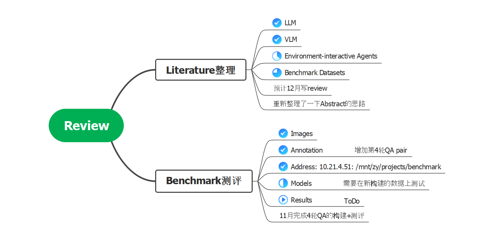
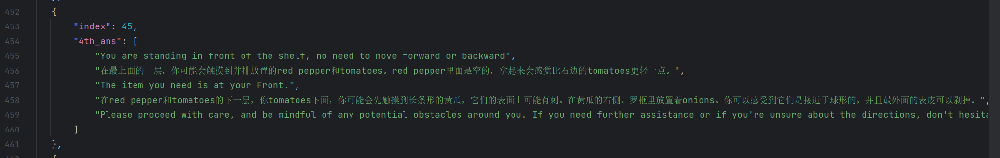
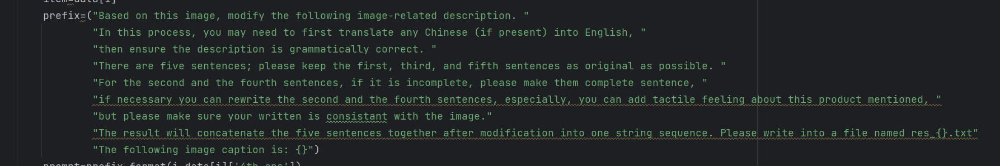
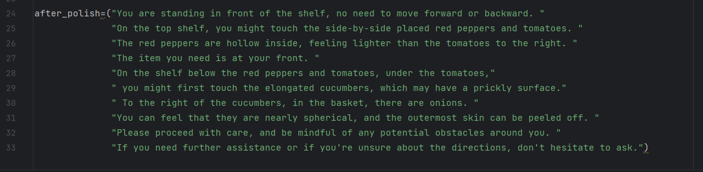
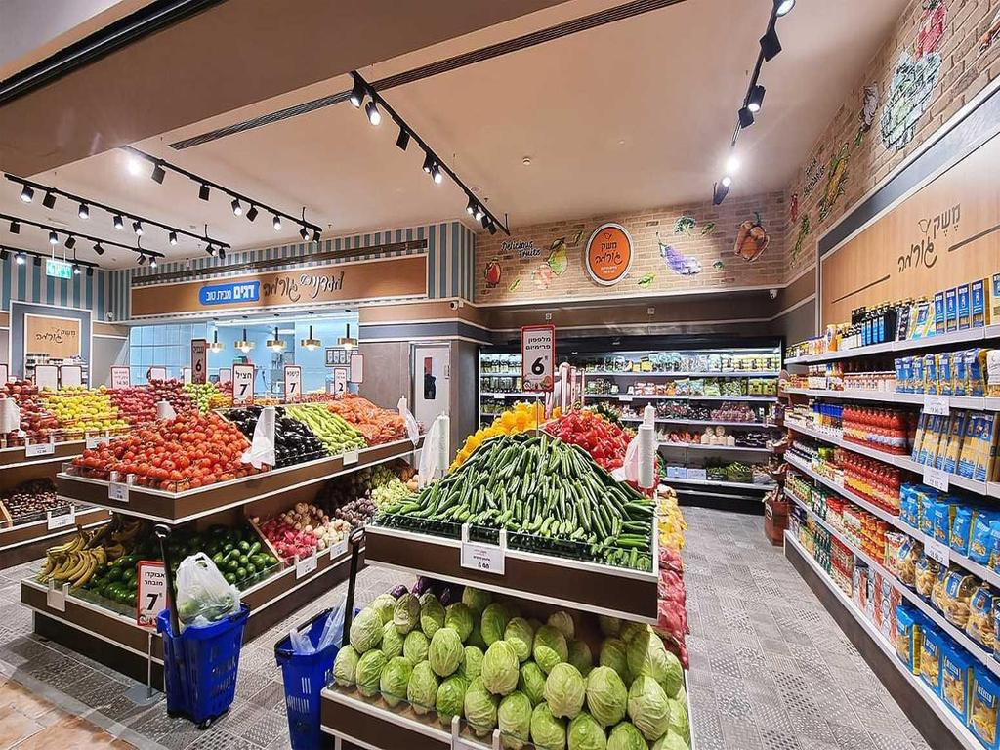

## 总览

## 进度
### 1.手工构建round 4 QA pair；

***pipeline包括***：

1. **人工描述draft**

2. **将draft和图片输入给GPT，输出polish之后的文本---调整prompt表述和输出的Q4 Answer**；

一个经过GPT-4调整的例子

现在这些都是手工操作的。。。。。。

3. **增加数据中的person_pos坐标**

| **Image**      |                                                                                                                                                                                                                                                                                                         |
|----------------|---------------------------------------------------------------------------------------------------------------------------------------------------------------------------------------------------------------------------------------------------------------------------------------------------------------------------------------|
| **1-U**        | "Hello, I am visually impaired and need your assistance; this is where I stand, and the scene depicted in the image is the view in front of me. Can you first inform me of the product area I am situated in? Is it the section for vegetables, fruits, beverages, snacks, or some other categories?"                                 |
| **1-U update** | "Hello, I am visually impaired and need your assistance; this is where I stand < pos >(12,748,36,765) < /pos >, and the scene depicted in the image is the view in front of me. Can you first inform me of the product area I am situated in? Is it the section for vegetables, fruits, beverages, snacks, or some other categories?" |

还可以增加一个实验点，在预测target区域的时候，以及提供guidance的时候，说起途径的其他商品，也一并提供坐标预测？
这个可以在专门做benchmark的时候加？

### 2. IJCAI Review适配
1. 重新构思了一下story的line。。。。
2. 开始用IJCAI的模版写，，，不过感觉由于篇幅限制，可能有内容的调整