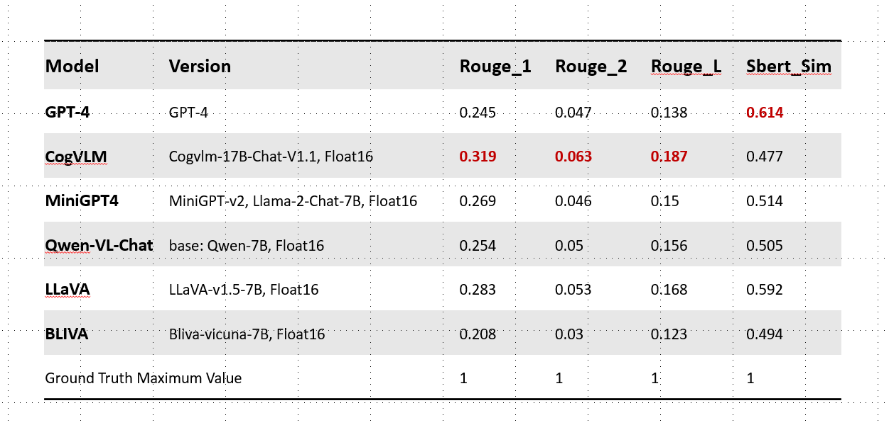

## 进度
### 1. 完成一版超市场景的测评

### 2. Todo
1. 构建benchmark 人工criteria： 1.following 容易；2.细节信息；3.触觉引导；4.正确--完成任务-----等
这部分工作可以等后面第二篇paper开展；

2. 引出触觉指导盲人：
   1. 提供 science theory 支持--视觉，语言，触觉----然而缺乏触觉； 
   2. survey要来研究-----引入触觉之后，现有大模型能否做到对盲人easy follow guidance

3. 下周，或者接下来两周完成：
   1. 居家场景测评
   2. 2.ppt---梳理故事----motivation，task formulation----输入输出real case，related work/research gap，benchmark，results

4. Timeline： 
   1. 2周 benchmark+ppt 
   2. 12月15号到20号----暂定19号上午--写introduction 
   3. 元旦之前---初稿---arxiv---回去查一下。。。 
   4. 1月17号
