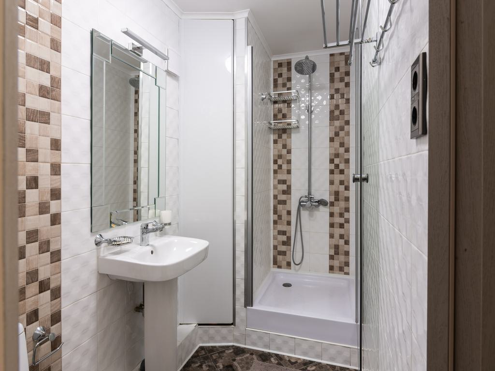
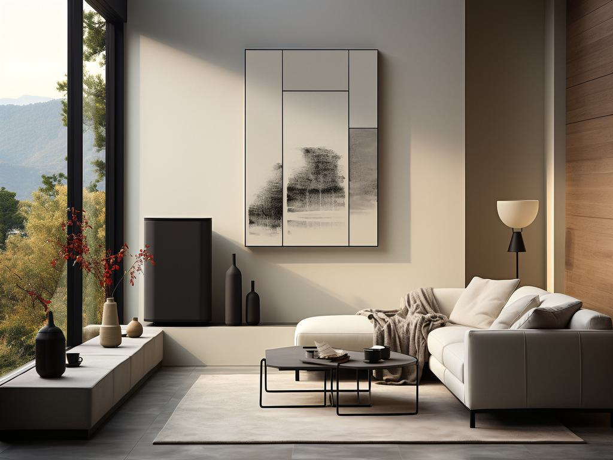
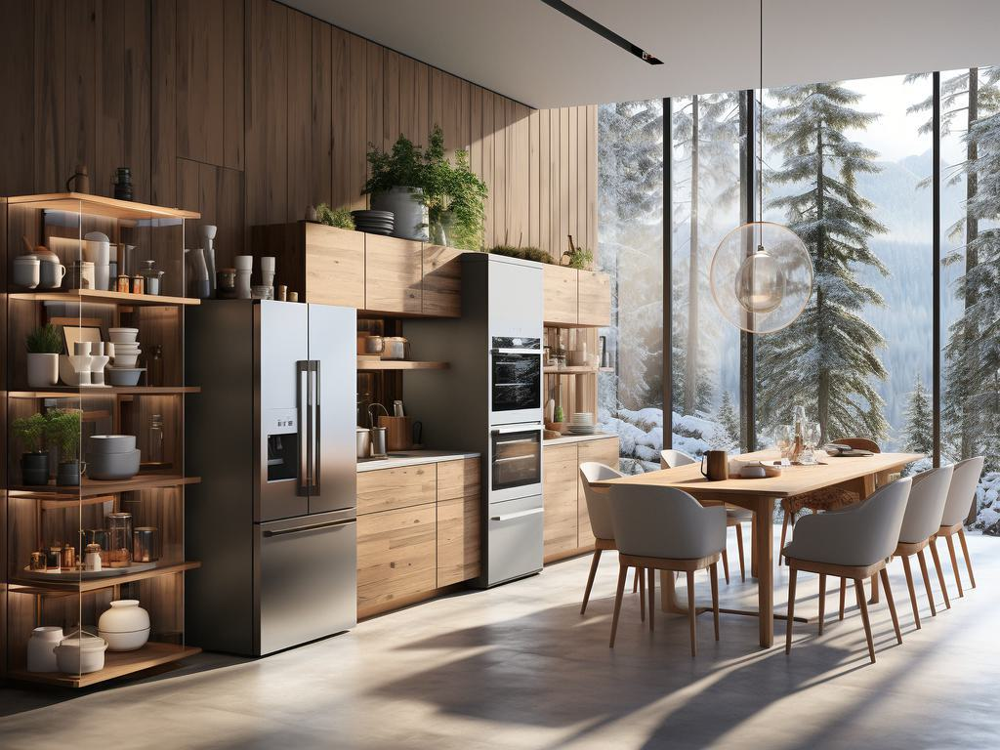

### 进度
#### 1.Review
##### 1.1 进度
* 修改一版Abstract--Done
* 修改一版Introduction--Done
* 修改Survey的3张表格（LLMs, VLMs, Embodied Agents）--Done

##### 1.2 ToDo
* 补充家居的实验，整理实验部分--预期12221-1228

##### 1.3 遇到的问题
* 参考文献需要修改，控制页数

#### 2. 家居场景实验
##### 2.1 进度
* 收集家居场景图片--Done
* 构建Ground-truth进度---1/10
* ToDo：完成全部样本构建+测评实验-1214~1221

##### 2.2 举例
1. 水龙头

|                                |
|--------------------------------|
|  |
| Starting from the current position; Please Move forward 2 steps, then Remain standing; Please Move forward 3 steps, then Remain standing. The shower room's door is open; you will encounter a relatively high step before entering. The bathroom floor may be damp and slippery, requiring caution for safety. The target object you want to approach is at your Front. The shower faucet, crafted from metal, has a smooth, icy, and solid surface. To the left is the shower hose, a circular tube with a spiral texture. The handle can possibly be rotated or turned on, causing water to flow out, which may initially be cold.                |

2. 沙发

|                       |
|-----------------------|
|  |
|Starting from the current position; Please Move forward 3 steps, then Turn right 90 degrees; Please Move forward 2 steps, then Remain standing. As you navigate the pathway, you might first walk on a hard floor before stepping onto a carpet. The floor's hardness gives way to the carpet's soft texture, and your footsteps sound muffled on it. If you're using a cane, you might detect a coffee table ahead. Its legs are metallic, and the surface could be marble, metal, or wood - all solid materials that produce a clear sound when tapped with the cane. The target object you want to approach is at your Middle lower. At the height of your knees and lower legs, you can feel the surface of the sofa, which may be leather or fabric, filled with something resilient like cotton or sponge. Square cushions rest on the sofa, with its rightmost end featuring an armrest. Sitting on the sofa brings a warm and comfortable sensation.|

3. 冰箱

|                                    |
|------------------------------------|
|      |
| Starting from the current position; Please Move forward 2 steps, then Turn left 90 degrees; Please Move forward 6 steps, then Remain standing. There are no obstacles in the passageway. The target object you want to approach is at your Front. The object you are approaching is a double-door refrigerator with a smooth, hard metallic surface. On the front are two protruding handles that you can grip to open the doors. Upon opening the refrigerator, you'll feel the cold emanating from within. Additionally, on the lower middle part of the left door, there's a square glass screen embedded into the door, offering a tactile contrast to the metallic surface.|

